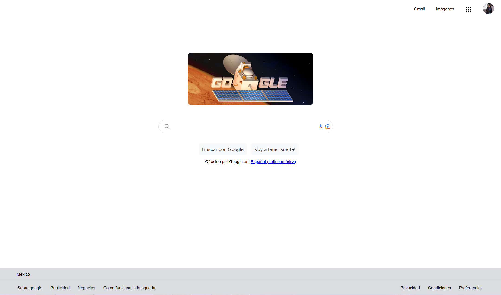

#Google Clon
Clonación de la Interfaz gráfica de Google 

  

## Intro
Este proyecto fue una práctica realizada en el bootcamp de Tecnolochicas Pro, donde se estuvieron utilizando componentes similares para poder replicar Google con nuestro toque personal, utilizando las herramientas de HTML5 y CSS. Una vez analizado los componentes se trato de replicar lo más parecido 

## ¿Cómo esta seccionada?

1. Sección Header:
   Esta compuesta por un header que contiene la barra de navegación similar a la Google, incluyen los links de: Gmail, Imagenes, Google Apps y la foto de perfil
2. Sección Main:
   En esta sección podemos encontrar la imagenes que nos aparece cuando entramos al buscador de Google, seguido de los iconos de búsqueda, cámara y micrófono
   En la parte inferior los botones de búsqueda y voy a tener suerte y por último el ofrecido de Google
4. Sección Footer:
   Se encuentra todos lo hipervínculo que nos dirigen a varios sitios de Google, como el aviso de privacidad, condiciones, preferencias,etc.
